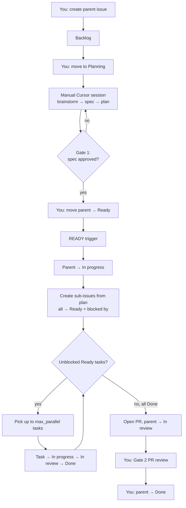

# GitHub Workflow & Backlog — Design Spec

**Status:** Draft — awaiting user review  
**Date:** 2026-07-06  
**Related:** [2026-07-06-ai-agent-orchestration-design.md](./2026-07-06-ai-agent-orchestration-design.md)

---

## Summary

Design for a solo-developer workflow that uses **GitHub Projects** as the control plane for feature backlog, roadmap visibility, and execution status — while keeping **Superpowers specs and plans in git** as the source of truth for requirements and task decomposition.

**Chosen approach:** GitHub Projects (Board + Roadmap views) with parent feature issues and child task sub-issues. Planning is manual; execution is triggered when a parent moves to **Ready**.

---

## Decisions Log

| Topic | Decision | Notes |
|---|---|---|
| Backlog tool | **GitHub Projects** | No Linear, no markdown sync layer for v1 |
| Idea format | **Short stubs** | Title + a few bullets; details emerge in brainstorming |
| Issue hierarchy | **Parent + sub-issues** | One parent per feature; one sub-issue per plan task |
| Planning phase | **Manual** | You start Cursor/Superpowers from Backlog/Planning |
| Execution trigger | **Parent → Ready** | After spec (Gate 1) and plan are complete |
| Task dependencies | **Ready + blocked by** | All sub-issues created Ready; GitHub blockers encode deps |
| Plan format | **Superpowers native** | Conductor parses `### Task N:` blocks; no custom table |
| Parent Done | **Human only** | You move parent to Done after Gate 2 (PR review) |
| Roadmap views | **Board + Roadmap** | One project, two views; milestones group releases |

---

## Context & Constraints

- **Team:** Solo developer, cost-conscious
- **Hosting:** GitHub
- **Planning tool:** Cursor + Superpowers (`/brainstorming` → spec → `writing-plans`)
- **Core principle:** State lives in files (specs, plans); GitHub issues are pointers and status trackers
- **Automation:** Grows incrementally — manual workflow first, Conductor bootstrap second

---

## Issue Model & GitHub Organization

### One GitHub Project, two views

| View | Purpose | What you see |
|------|---------|--------------|
| **Board** | Day-to-day execution | Parent issues as cards in status columns |
| **Roadmap** | Release planning | Parent issues on a timeline, grouped by **Milestone** |

Both views share a single **Status** project field.

### Issue types

| Type | GitHub representation | Purpose |
|------|----------------------|---------|
| **Feature (parent)** | Top-level issue | Idea stub through full feature lifecycle |
| **Task (child)** | Sub-issue of parent | One Superpowers plan task; AI owns status |

Only **parent issues** appear on the Board and Roadmap. Child tasks are visible on the parent's sub-issue list.

### Status field (6 values)

| Status | Used by | Meaning |
|--------|---------|---------|
| **Backlog** | Parent | Raw idea stub; not yet in planning |
| **Planning** | Parent | Manual brainstorm → spec → plan in progress |
| **Ready** | Parent + child | Parent: plan complete, trigger execution. Child: in execution pool |
| **In progress** | Parent + child | Active work |
| **In review** | Parent + child | Awaiting review (Gate 2 for parent; QA/reviewer for child) |
| **Done** | Parent + child | Complete (parent Done: **human only**) |

### Milestones

Roadmap buckets for parent issues. Examples:

- `v0.1 — Workflow bootstrap`
- `v0.2 — Thin Conductor CLI`
- `v0.3 — Test harness app`

### Labels (minimal)

| Label | Applied to | Meaning |
|-------|------------|---------|
| `type:feature` | Parent | Feature work |
| `type:task` | Child | Plan-derived task |
| `needs:triage` | Parent in Backlog | Stub needs refinement |
| `risk:high` | Either | Escalates model tier (future Conductor use) |

Status is **not** encoded as labels — the Project Status field handles that.

### Parent issue template

```markdown
## Problem
<!-- 1-2 sentences -->

## Desired outcome
<!-- what "done" looks like, roughly -->

## Constraints
<!-- optional -->

## Links
- Spec: (added during Planning)
- Plan: (added during Planning)
- PR: (added when opened)
```

### Child issue template (created by automation)

```markdown
**Parent:** #<parent-number>
**Task ID:** Task N (from plan heading)
**Plan:** docs/superpowers/plans/YYYY-MM-DD-<feature>.md
**Spec:** docs/superpowers/specs/YYYY-MM-DD-<feature>-design.md

## Files
<!-- copied from plan **Files:** block -->

## Blocked by
<!-- set via GitHub blocked-by links -->
```

---

## Status Lifecycle & Ownership

### Parent lifecycle

```
You create issue          → Backlog
You start manual agent    → Planning
Gate 1 + plan complete    → Ready        (you move — fires automation)
Automation picks up       → In progress
All children Done + PR    → In review    (automation)
You approve PR            → Done         (you only)
```

**Gate 1** happens during the manual Planning session: you approve the spec before moving to Ready. Moving parent → **Ready** means "spec approved, plan written, start execution."

### Child task lifecycle (Model B: Ready + blockers)

When automation creates sub-issues from the plan:

1. Create one sub-issue per `### Task N:` block in the Superpowers plan.
2. Set Status → **Ready** for all.
3. If the task has dependencies, add GitHub **`blocked by`** links to the resolved sub-issues.

**Status** tracks pipeline phase. **`blocked by`** tracks scheduling eligibility. These are not mixed.

### Task picker (Conductor scheduler)

```text
eligible = sub-issues where:
  parent.status == In progress
  child.status == Ready
  child.blocked_by.all(closed or Done)
  child not already in a running worktree

sort by plan task order
take min(eligible, max_parallel)   # default max_parallel = 2 for solo dev
→ In progress → execute → In review → Done
```

When a child moves to **Done**, dependents remain **Ready** but become unblocked — no status promotion automation needed.

### Ownership summary

| Transition | Actor | Applies to |
|------------|-------|------------|
| → Backlog | You | Parent |
| Backlog → Planning | You | Parent |
| Planning → Ready | You | Parent |
| Ready → In progress | Automation | Parent |
| In progress → In review | Automation | Parent (all children Done + PR) |
| In review → Done | **You** | Parent |
| → In progress | Automation | Child (when picked from Ready + unblocked) |
| In progress → In review → Done | Automation | Child |
| In review → In progress | Automation | Child (revision round) |

---

## End-to-End Flow



---

## Plan Integration (Superpowers Format)

**No custom plan table format.** Superpowers `writing-plans` skill generates the plan; Conductor parses it.

### Parser contract

Conductor bootstrap reads `docs/superpowers/plans/YYYY-MM-DD-<feature>.md` and extracts:

| Field | Source in plan |
|-------|----------------|
| Task ID | `Task N` from `### Task N: Title` heading |
| Title | Heading text after colon |
| Scoped files | `**Files:**` block |
| Dependencies | Optional `**Depends on:** Task 1, Task 3` line per task |
| Steps | Checkbox items — stay in plan; agent reads during execution |

### Sub-issue granularity

- **One sub-issue per `### Task N:` block** — not per checkbox step.
- Checkbox steps are execution detail inside the plan file.

### Dependencies

**Recommended:** add one optional line per task in the plan (via `AGENTS.md` or future writing-plans tweak):

```markdown
### Task 2: POST /api/habits route

**Depends on:** Task 1

**Files:**
- Create: `apps/web/app/api/habits/route.ts`
```

Conductor resolves `Task 1` → sub-issue `#101` and sets `blocked by #101` on Task 2's sub-issue.

**Not recommended for v1:**

- Inferring deps from `Interfaces: Consumes` prose (fragile)
- Default linear chain (Task N blocked by Task N−1) — breaks parallelism

---

## Automation & Data Flow

### Components

| Component | Role | v1 implementation |
|-----------|------|-------------------|
| GitHub Project | Status board + roadmap | Manual setup once |
| Issue templates | Parent/child stubs | `.github/ISSUE_TEMPLATE/` |
| Plan file | Task list + deps | Superpowers output in git |
| READY listener | Detects parent → Ready | GitHub Action |
| Conductor CLI | Bootstrap, task picker, execution | TypeScript (grows over time) |
| Cursor / OpenCode | Agent runtime | Existing tools |

### Trigger 1 — Manual planning

1. Create parent issue in **Backlog**.
2. Move to **Planning** when starting Cursor session.
3. Run Superpowers: `/brainstorming` → spec → Gate 1 → `writing-plans`.
4. Agent updates parent issue with spec + plan links.
5. You move parent → **Ready**.

### Trigger 2 — READY (execution bootstrap)

When parent Status → **Ready**:

1. GitHub Action detects status change on a `type:feature` issue.
2. Invokes `conductor bootstrap --issue <parent#>`.
3. Conductor moves parent → **In progress**.
4. Parses plan file; creates sub-issues (Ready + blocked by).
5. Runs task picker loop until all children Done.
6. Opens PR; moves parent → **In review**.

```yaml
# .github/workflows/ready-trigger.yml (sketch)
on:
  projects_v2_item:
    types: [edited]
jobs:
  bootstrap:
    if: status changed to Ready AND label type:feature
    runs-on: ubuntu-latest
    steps:
      - uses: actions/checkout@v4
      - run: npx conductor bootstrap --issue ${{ github.event.issue.number }}
```

Before Conductor exists: manually create sub-issues from plan to validate the workflow.

### Git vs GitHub split

| Data | Source of truth | GitHub holds |
|------|-----------------|--------------|
| Idea stub | Issue body | Parent issue |
| Spec / plan | Git files | Links only |
| Task list + deps | Plan file | Sub-issues mirror plan |
| Execution status | Project Status field | Per issue |
| Code | Git branches/PRs | PR links |

---

## Error Handling

| Scenario | Behavior |
|----------|----------|
| Ready but no plan link | Fail; comment on issue. No sub-issues created. |
| Plan missing or unparseable | Fail; comment with error. |
| Sub-issues already exist | Idempotent: skip creation, run task picker only. |
| Task fails after 2 retries | Sub-issue → In review + failure comment. You decide next step. |
| Circular dependencies | Bootstrap fails; comment listing cycle. |
| Blocked task picked by bug | Conductor re-checks blockers before worktree; abort if blocked. |
| READY fires twice | Idempotency on parent# + plan file hash. |

---

## v1 Bootstrap Checklist

Minimum setup before automation:

1. Initialize git repo and push to GitHub.
2. Create GitHub Project with Status: Backlog, Planning, Ready, In progress, In review, Done.
3. Add Board and Roadmap views.
4. Create milestones (`v0.1 — Workflow bootstrap`, etc.).
5. Add issue templates (`feature.md`, `task.md`).
6. Add labels: `type:feature`, `type:task`, `needs:triage`, `risk:high`.
7. Add `AGENTS.md` rule: include `**Depends on:**` in plan tasks when deps exist.
8. Dry-run one feature manually through all statuses.
9. Build Conductor bootstrap + READY Action.
10. Integration test: Ready → sub-issues + blockers + parallel pickup.

---

## Maintenance Burden (Solo Dev)

| Activity | Frequency | Effort |
|----------|-----------|--------|
| Capture idea | Per idea | ~2 min |
| Start planning | Per feature | Drag to Planning, open Cursor |
| Promote to execution | Per feature | Drag to Ready after plan |
| Review & close | Per feature | Gate 2 + move to Done |
| Board hygiene | Weekly (optional) | Archive Done, adjust milestones |

---

## Testing

1. **Dry run:** one parent through all statuses manually.
2. **Parser unit test:** sample Superpowers plan → tasks, files, deps extracted.
3. **Integration test:** Ready → sub-issues + blocked-by links match plan.
4. **Parallel test:** two tasks share one dependency → both picked when unblocked.

---

## Out of Scope (v1)

- Linear or other external ticket trackers
- Markdown backlog sync layer (`docs/backlog/`)
- Sub-issues per checkbox step
- Custom plan table format
- Automated parent → Done

---

## Evolution Path

| Trigger | Action |
|---------|--------|
| GitHub automation feels painful | Revisit Linear adapter (see main orchestration spec) |
| Plan dep parsing unreliable | Add `**Depends on:**` to writing-plans skill template |
| Board Ready column cluttered | Add filtered "Runnable" view (Ready + unblocked) |
| Backlog grows large | Optional `docs/backlog/` stubs synced to issues |

---

## Brainstorming Progress

| Step | Status |
|------|--------|
| Explore project context | Done |
| Clarifying questions | Done |
| Propose 2–3 approaches | Done — GitHub Projects chosen |
| Present design sections | Done — all sections approved |
| Write design doc | Done — this file |
| Spec self-review | Done |
| User review | Pending |
| Invoke writing-plans skill | Pending (after approval) |
